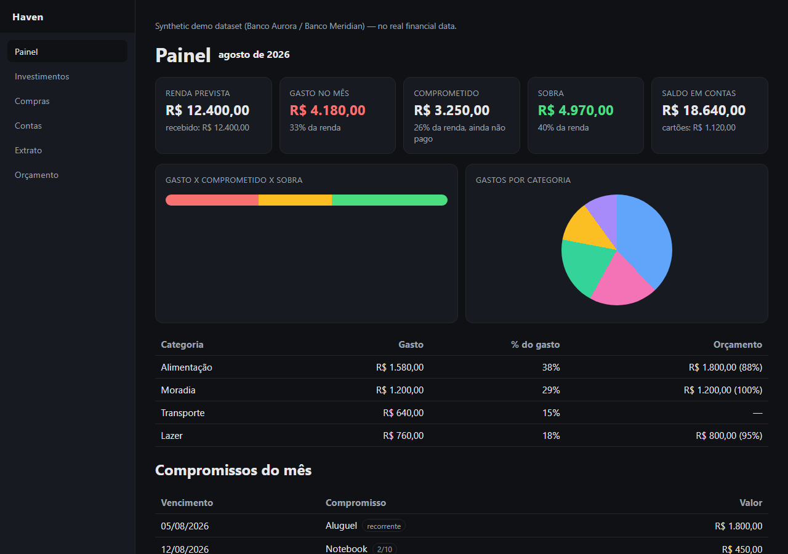
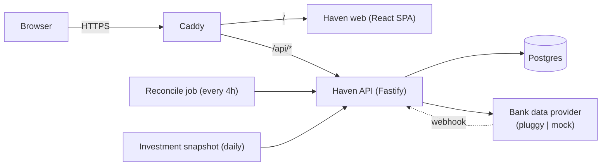

# Haven

[](https://github.com/lucas-lima-s/uniquedev/actions/workflows/ci.yml)
[](LICENSE)

A self-hosted personal finance app for Open Finance Brasil: bank sync
through a pluggable provider, a month projection that counts committed
money (not just past spend), budgets, planned purchases and investment
tracking, all in integer cents.



*Screenshots use the built-in demo dataset (synthetic data generated by
`pnpm seed:demo`) — no real financial data is shown.*

## Why

Aggregating Open Finance data into one dashboard is a solved problem. What
this adds is a **month projection that counts committed money, not just
past spend**: recurring bills, a yearly expense provisioned as a monthly
twelfth, and an approved installment purchase all show up as commitments in
the current month even before a single transaction posts, next to what has
actually been spent so far. The gap between "what I've spent" and "what I'm
already on the hook for" is the number that matters for planning ahead.

## Features

- Bank sync through a pluggable provider — real Open Finance Brasil
  connections via Pluggy, or a deterministic synthetic dataset with zero
  third-party account required.
- Month projection: projected income, realized spend, open commitments
  (recurring, yearly provisions, approved purchase installments) and what
  remains — one pure, unit-tested engine reused by the API and the web app.
- Budgets per category, with usage tracked against the projection.
- Planned purchases that move from draft to approved to purchased, with
  cash or installment payment modes.
- An investment portfolio with manual assets, provider-synced assets, and
  daily value snapshots for a history chart.
- A webhook endpoint that accepts either header- or query-parameter-based
  secret delivery, a periodic reconciliation job, and a daily snapshot job.

## Architecture



See [`docs/architecture.md`](docs/architecture.md) for the sync algorithm,
the webhook lifecycle, and the projection engine in detail.

## Design decisions

- **Integer cents end to end.** Every monetary value is a `bigint` count of
  cents, never a float, from the database column to the API response to the
  UI. `reaisToCents` is the one place a decimal amount gets converted, and
  it rounds explicitly.
- **The projection engine is a pure package.** `packages/shared`'s projection
  code has no framework dependency, is unit tested in isolation, and is
  imported verbatim by both the API and the web app — there is exactly one
  implementation of "what does this month look like".
- **Provider abstraction (`pluggy` \| `mock`).** The whole app — sync, tests,
  the demo seed, the screenshots below — runs against a deterministic mock
  provider with no third-party account. Switching to `pluggy` requires only
  an environment variable and real credentials.
- **Identity via an identity-aware proxy, not an in-app user table.** The
  API trusts a signed JWT forwarded by whatever proxy sits in front
  (Cloudflare Access, oauth2-proxy, Pomerium, ...). There is exactly one
  owner per deployment by design.
- **Migrations never run at container boot.** They are an explicit, manual
  step after every deploy that ships one.

## Quick start (demo mode, no accounts needed)

```bash
git clone https://github.com/lucas-lima-s/uniquedev.git
cd uniquedev
cp .env.example .env
docker compose -f docker-compose.yml -f docker-compose.dev.yml up -d --build
docker compose -f docker-compose.yml -f docker-compose.dev.yml run --rm api node dist/migrate.js
docker compose -f docker-compose.yml -f docker-compose.dev.yml run --rm api node dist/seed/demo.js
```

Open `http://localhost:8080/`. The default `DATA_PROVIDER=mock`
serves a seeded, deterministic demo dataset (two fictional institutions,
~180 transactions, five investments) — nothing here talks to the internet
or to a real bank.

## Local development

```bash
pnpm install
cp .env.example .env
docker compose -f docker-compose.yml -f docker-compose.dev.yml up -d db   # Postgres on 127.0.0.1:55433
pnpm dev:shared                 # rebuilds packages/shared/dist on change; api and web import from dist
pnpm dev:api                    # http://localhost:3000, loads ../../.env
pnpm dev:web                    # http://localhost:5173/, proxies /api to :3000
pnpm test
pnpm typecheck
pnpm lint
```

For the API to run outside Docker, `.env` needs `NODE_ENV=development`,
`AUTH_MODE=dev`, `DATA_PROVIDER=mock`, and
`DATABASE_URL=postgres://haven:<password>@127.0.0.1:55433/haven` (the dev
override publishes the database on that port). `AUTH_MODE=dev` injects a
fixed identity instead of verifying a proxy JWT, and is refused whenever
`NODE_ENV=production`.

## Connecting real bank data

1. Set `DATA_PROVIDER=pluggy` and fill in `PLUGGY_CLIENT_ID` /
   `PLUGGY_CLIENT_SECRET` from an application created at
   `dashboard.pluggy.ai`.
2. Generate a webhook secret (`openssl rand -hex 32`) into `WEBHOOK_SECRET`,
   and set `WEBHOOK_PUBLIC_URL` to a URL your deployment is reachable at,
   for example `https://your-domain.example/api/webhooks?token=<secret>`.
   Register that URL with the data provider.
3. Open `/conectar` and connect an account through the widget. The
   connection id is captured from both the widget callback and the
   `item/created` webhook.

## Deployment

See [`docs/deployment.md`](docs/deployment.md) for a single-host Docker
Compose deployment, the full environment variable reference, and how to
wire `AUTH_MODE=proxy` to an identity-aware proxy of your choice.

## Testing

- `packages/shared`: unit tests for money math, month math, and every
  projection rule (recurring rollover, installment rounding, budget usage).
- `packages/api`: an integration suite against a real Postgres instance —
  authentication in both modes, the webhook secret gate, every CRUD route,
  and a fixed-seed dashboard assertion.
- `packages/web`: a smoke suite for the API client, the app shell, and the
  dashboard page against a stubbed fetch.
- CI additionally runs a full Docker Compose smoke test against the demo
  dataset, asserting the health, dashboard, and SPA endpoints all respond.

## Project layout

| Path | What |
|---|---|
| `packages/api` | `@haven/api`. Fastify API: verifies the proxy identity, talks to the active data provider, owns the Haven database. |
| `packages/web` | `@haven/web`. Vite + React SPA built at the domain root, served as static files by Caddy. |
| `packages/shared` | `@haven/shared`. Zod schemas, money helpers and the projection engine shared by api and web. |
| `infra/caddy` | Caddyfile (root path) and Caddyfile.subpath (mounting Haven under a prefix), plus the Caddy image build. |
| `docker-compose.yml` | The whole stack, pinned to the project name `haven` so volumes do not depend on the checkout path. |

## License

[MIT](LICENSE) © 2026 Lucas Lima
